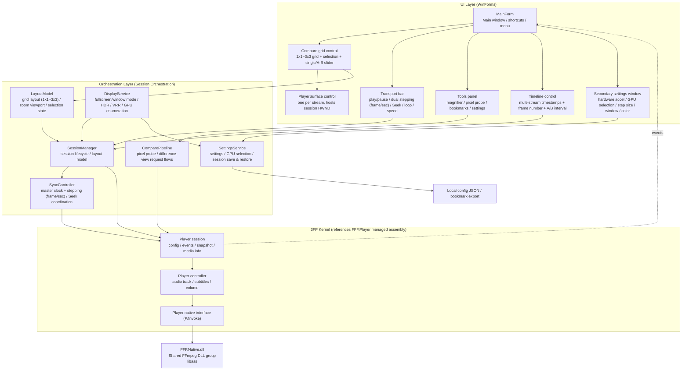
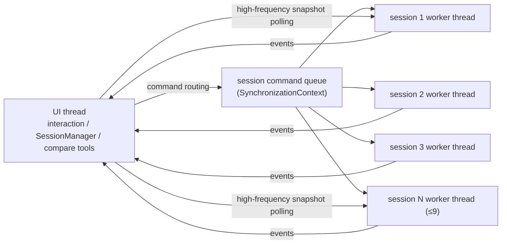

# 02 System Architecture

<div align="center">

**English** · [**简体中文**](02-系统架构.zh.md)

</div>

## 1. Overall Layering

Adopts a **WinForms + .NET 11** single-process architecture; multi-stream playback relies on **multiple 3FP `player session` instances**, each holding its own
HWND output (D3D11 flip-model swap chain), coordinated by a **session orchestration layer**.



## 2. Process / Thread Model

- **UI thread**: WinForms message loop, handles all interaction and navigation.
- **3FP semantics**:
  - Each `player session` has an **independent playback worker thread** on the Native side (decode, present, clock);
  - Low-frequency events are **serialized back to the UI thread** through `player config.event sync context` (written to the UI `SynchronizationContext`);
  - High-frequency polling goes through lock-free reads such as `current snapshot`/`read audio peaks`, without blocking WASAPI / "not accessing device objects".
- **Orchestration layer**: every action that triggers a player command must be **serialized on the UI thread** (the same SynchronizationContext),
  to avoid races from multiple threads sending commands to Native sessions concurrently. The SyncController "metronome" can use
  `PrecisionTimer`/`System.Threading.Timer`, but command dispatch is uniformly Post-ed back to the UI context.



## 3. Module Responsibilities

| Module | Responsibility | Key types (suggested) |
| --- | --- | --- |
| `3FCompare.App` | Entry, DI/composition root, main form assembly | `Program`, `AppShell` |
| `3FCompare.Core.Backend` | Backend abstraction (`IPlayerEngine` etc.) + 3FP adapter `Backend.3FP`; **hardware decode switch / GPU specification (per session)** | `IPlayerEngine`, `EngineSession`, `EngineMediaInfo`, `AdapterSelection` (GPU enumeration/selection) |
| `3FCompare.Core.Sync` | Sync model: master clock, frame/second dual stepping, offsets | `SyncController`, `FrameReference`, `StepProfile` (frame step / second step), `OffsetCorrector` |
| `3FCompare.Core.Compare` | Pixel probe, difference capture, bookmarks | `PixelProbe`, `DiffCollector`, `BookmarkStore` |
| `3FCompare.Core.Display` | **Display/ACM/VRR/fullscreen capability probing & management** (HDR availability, bit depth, gamut, swap-chain params, window DWM attributes, fullscreen switching) | `DisplayCapabilities`, `WindowPresentation`, `FullscreenController` (see 4.4) |
| `3FCompare.Core.Settings` | Loading/saving of settings & session snapshots; **secondary settings window data model** | `SettingsStore`, `SessionSnapshot`, `AppSettings` (incl. step size / GPU / window mode) |
| `3FCompare.UI.Controls` | Custom-drawn controls: compare grid, PlayerSurface, timeline, transport bar | `CompareGridView`, `PlayerSurface` (see below), `TransportBar` (with dual stepping buttons), `TimelineView` |
| `3FCompare.UI.Tools` | Magnifier, pixel probe panel, A-B slider, single view | `MagnifierOverlay`, `ProbePanel`, `AbSpitterView` |
| `3FCompare.UI.Settings` | **Secondary settings dialog** (hardware/GPU/stepping/window/color/layout) | `SettingsDialog`, `HardwarePage`, `SteppingPage`, `WindowPage` |

## 4. Key Control Design & Render Paths

### 4.1 PlayerSurface (one per stream)

- Inherits `Control`; at `CreateControl`/`HandleCreated`, **creates a child window or reuses the native window handle**,
  passing the `output window handle` 3FP needs to `player config.output window handle` (can also call `set output window` after window creation).
- 3FP's D3D11 rendering outputs directly to this HWND (flip-model swap chain), **with no third-party intervention**.
- Notes (from the 3FP README):
  - **Two flip-model chains must not coexist on the same window** → each Surface must be an independent native window; embedding another 3FP window inside is forbidden;
  - After window resize / moving to another monitor, **call `set output window` again**; the old swap chain and its window must be unbound before opening another;
  - When switching media causes an SDR↔HDR swap-chain switch, 3FP reconfigures automatically; we only need to keep the HWND lifecycle valid.

### 4.2 Compare Grid (CompareGridView)

- Handles **1x1 ~ 3x3** layouts (1/2/3/4/6/9 streams): N `PlayerSurface`s placed inside a `TableLayoutPanel`/custom-drawn panel;
- Maintains "selected stream" state (click highlight border);
- On layout switch only adjusts Surface position/size and **calls back SessionManager to update the output window size**;
- Zoom/pan (F15) drives each Surface's crop rectangle through `LayoutModel.Viewport`:
  Approach: instead of scaling the D3D output in the UI layer (avoiding double sampling), send each session a "viewport rectangle" (normalized 0..1) so 3FP outputs the sub-region at 1:1/Lanczos — need to verify whether 3FP exposes viewport settings (no explicit viewport parameter seen in the current API, see 06 Risk: viewport-crop capability pending),
  Fallback: UI layer `DrawImage` samples/scales the readback buffer.

### 4.3 Tool Layer & Render Overlays

- **Overlay UI** such as magnifier / probe annotation / A-B slider divider is GDI+ custom-drawn on top of the Surface (overlay layer),
  without affecting 3FP's D3D present thread (3FP README explicitly forbids multiple threads submitting to the swap chain directly; we avoid any D3D intervention).
- Pixel probe reads go entirely through `ReadVideoPixel` (1x1 readback), no screenshots.
- **Overlay color contract**: the overlay is composited on the UI side and belongs to a different semantic space from the D3D video buffer (pre-color-management);
  on ACM/HDR windows it doesn't participate in the video frame's HDR metering and doesn't write HDR metadata (SDR text/graphics handled by the system),
  avoiding overlay interference with VRR/color decisions.

### 4.4 Display / ACM / VRR (new module)

**Goal**: probe and, at session/window creation, map display capability, color-space and VRR-related constraints onto 3FP config and window attributes.

- `DisplayCapabilities`: enumerates adapters/outputs via DXGI (`DXGI_OUTPUT_DESC`, desktop coords, rotation, color-space support,
  HDR metadata `DXGI_COLOR_SPACE_*`) to judge whether the display hosting the session has Advanced Color / HDR / bit depth enabled;
  pairs with 3FP's `color mode change` event + snapshot.actualColorMode for fallback notices.
- `WindowPresentation`: binds the **session HWND to the 3FP output window** and re-evaluates at these moments:
  - window moved across monitors / monitor unplugged (re-probe target display capability, trigger a 3FP color-mode change if needed);
  - DPI change (if only scaling is involved, the 3FP adapter can re-set the output window internally).
- VRR:
  - The playback window is a standalone top-level window; **no fixed refresh rate set / no Present cadence locked** (unless 3FP provides an AdaptSync/VRR API, see 03 A9);
  - If 3FP exposes Present cadence/target-frame-rate parameters, pass the "follow media frame rate" option through to the user (F27);
  - Reuse DWM fullscreen optimization on fullscreen/borderless switch (`DXGI_SWAP_CHAIN_FLAG_ALLOW_TEARING` handled internally by 3FP or not needs confirmation, see A8).
- **Probe/color-read consistency**: all sessions read the "pre-color-management" native buffer, ensuring cross-stream comparison isn't polluted by DWM post-processing; when HDR and SDR play mixed, unify to the same `color mode` before comparing.

### 4.5 Secondary Settings Window (SettingsDialog)

- Standalone modal dialog (`F25`), opened from the main window menu/toolbar;
- Page breakdown:
  - **Hardware page**: hardware decode master switch, per-stream GPU selection (`AdapterSelection` enumerates system adapters, listing name/VRAM/decode capability), hardware render switch;
  - **Stepping page**: frame step size (default 1 frame, adjustable ±N), second step size (default 1 second, adjustable ±N), step key bindings;
  - **Window page**: default startup mode (window/fullscreen), which UI to hide in fullscreen, window-size memory;
  - **Decode/color page**: CPU/GPU decode, color mode (SDR/HDR/ACM), audio track;
  - **Layout page**: default grid rows/cols, per-stream independent decode config;
  - **Other**: shortcut scheme, probe preferences, VRR presentation options (if A8/A9 supported).
- Two strategies: immediate change or "restart session on apply" (annotated per page): hardware-page changes require rebuilding affected sessions; stepping/window-page changes take effect immediately.
- Settings persist via `SettingsStore` (JSON), respecting NativeAOT serialization limits (see 06 R15).

### 4.6 Fullscreen / Window Mode (FullscreenController)

- **Window mode**: normal WinForms form, resizable/maximizable;
- **Fullscreen mode**: borderless + `WindowState.Maximized`/exclusive fullscreen, hides timeline/toolbar, keeps only the grid and necessary overlays;
- Fullscreen switching must handle: output window resize (3FP `set output window`), DWM fullscreen optimization (VRR-related),
  Surface layout reflow, ESC/hotkey exit;
- In fullscreen the multi-stream grid keeps 1x1~3x3 layout; the selected stream can be temporarily enlarged to a single cell.

## 5. Event Flow

```mermaid
sequenceDiagram
    participant UI as UI thread
    participant SM as SessionManager
    participant P as Player session
    participant N as FFF.Native

    UI->>SM: open video (A.mp4)
    SM->>P: create session (output window = Surface.HWND, event sync context = UI)
    P->>N: FFF3FP_Create / FFF3FP_Open
    N-->>P: open completed event