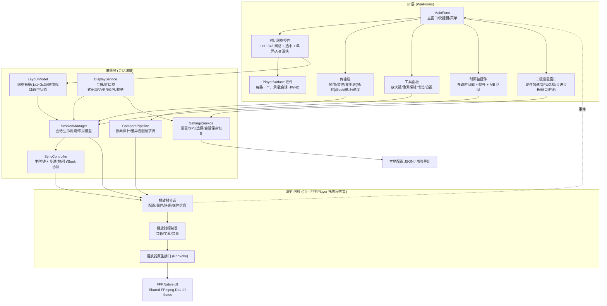
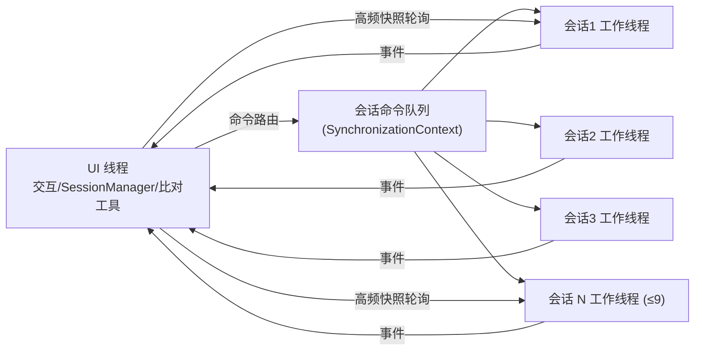
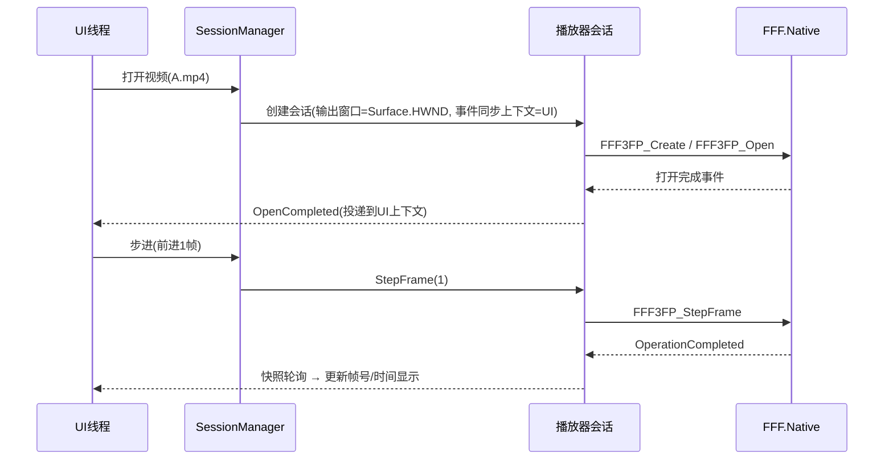

# 02 系统架构

## 1. 总体分层

采用 **WinForms + .NET 11** 单进程架构；多路播放依靠 **多个 3FP `播放器会话` 实例** 各自持有
HWND 输出（D3D11 flip-model 交换链），由 **会话编排层** 统一调度。

## 2. 进程/线程模型

- **UI 线程**：WinForms 消息循环，处理所有交互与导航。
- **3FP 语义**：
  - 每个 `播放器会话` 在 Native 侧有**独立播放工作线程**（解码、呈现、时钟）；
  - 低频事件通过 `播放器配置.事件同步上下文`（写入 UI `SynchronizationContext`）**串行投递回 UI 线程**；
  - 高频轮询走 `当前快照`/`读取音频峰值` 等无锁读取，不阻塞 WASAPI/“不访问设备对象”。
- **编排层**：所有触发播放器命令的动作都必须**经 UI 线程串行化**（同一 SynchronizationContext），
  避免多线程同时向 Native 会话发命令引发竞态。SyncController 的“节拍器”可用
  `PrecisionTimer`/`System.Threading.Timer` 触发，但命令投递统一 Post 回 UI 上下文。

## 3. 模块职责

| 模块 | 职责 | 关键类型（建议） |
| --- | --- | --- |
| `3FCompare.App` | 入口、DI/组合根、主窗体装配 | `Program`, `AppShell` |
| `3FCompare.Core.Backend` | 后端抽象（`IPlayerEngine` 等）+ 3FP 适配器 `Backend.3FP`；**硬件解码开关/GPU 指定（逐个会话）** | `IPlayerEngine`, `EngineSession`, `EngineMediaInfo`, `AdapterSelection`（GPU 枚举/选择） |
| `3FCompare.Core.Sync` | 同步模型：主时钟、帧/秒双步进、偏移 | `SyncController`, `FrameReference`, `StepProfile`（帧步长/秒步长）, `OffsetCorrector` |
| `3FCompare.Core.Compare` | 像素探针、差异摄取、书签 | `PixelProbe`, `DiffCollector`, `BookmarkStore` |
| `3FCompare.Core.Display` | **显示/ACM/VRR/全屏模式能力探测与管理**（HDR 可用性、位深、色域、交换链参数、窗口 DWM 属性、全屏切换） | `DisplayCapabilities`, `WindowPresentation`, `FullscreenController`（详见 4.4） |
| `3FCompare.Core.Settings` | 设置与会话快照的加载/保存；**二级设置窗口数据模型** | `SettingsStore`, `SessionSnapshot`, `AppSettings`（含步进步长/GPU/窗口模式） |
| `3FCompare.UI.Controls` | 自绘控件：对比网格、PlayerSurface、时间轴、传输栏 | `CompareGridView`, `PlayerSurface`（详见下文）, `TransportBar`（含双步进按钮）, `TimelineView` |
| `3FCompare.UI.Tools` | 放大镜、像素探针面板、A-B 滑块、单屏 | `MagnifierOverlay`, `ProbePanel`, `AbSpitterView` |
| `3FCompare.UI.Settings` | **二级设置对话框**（硬件/GPU/步进/窗口/色彩/布局） | `SettingsDialog`, `HardwarePage`, `SteppingPage`, `WindowPage` |

## 4. 关键控件设计与渲染路径

### 4.1 PlayerSurface（每路一个）

- 继承 `Control`，在 `CreateControl`/`HandleCreated` 时**创建子窗口或复用原生窗口句柄**，
  将 3FP 需要的 `输出窗口句柄` 交给 `播放器配置.输出窗口句柄`（窗口创建后也可调用 `设置输出窗口`）。
- 3FP 的 D3D11 渲染直接输出到此 HWND（flip-model 交换链），**没有第三方插足**。
- 注意（源自 3FP README）：
  - 同一窗口上**不得并存两个 flip-model 链** → 每路 Surface 必须是独立原生窗口，禁止在内部再嵌另一个 3FP 窗口；
  - 窗口 resize / 移动显示器后需**再次调用 `设置输出窗口`**，且旧交换链与其窗口必须解绑后才能另开；
  - 切换媒体导致 SDR↔HDR 交换链切换时，3FP 会自动重配；我们只需保证 HWND 生命周期合法。

### 4.2 对比网格（CompareGridView）

- 负责 **1x1 ~ 3x3** 布局（1/2/3/4/6/9 路）：一个 `TableLayoutPanel`/自绘面板内放置 N 个 `PlayerSurface`；
- 维护“选中路”状态（点击高亮边框）；
- 布局切换时仅调整 Surface 的位置/大小并**回调 SessionManager 更新输出窗口尺寸**；
- 缩放/平移（F15）通过 `LayoutModel.Viewport` 驱动各 Surface 的裁剪矩形：
  方案：UI 层不缩放 D3D 输出（避免二次采样），而是给各会话发“视口矩形”（0..1 归一化）由 3FP 以 1:1/Lanczos 输出子区域——需要核对 3FP 是否暴露视口设置（目前 API 未见显式视口参数，见 06 风险：视口裁剪能力待确认），
  兜底方案：UI 层 `DrawImage` 对回读缓冲采样缩放。

### 4.3 工具层与渲染叠加

- 放大镜/探针标注/A-B 滑块分隔线等 **叠加 UI** 使用 GDI+ 自绘在 Surface 之上（覆盖层），
  不影响 3FP 的 D3D 呈现线程（3FP README 明确禁止多个线程直接提交交换链，我们会避免任何 D3D 干预）。
- 像素探针读取完全走 `ReadVideoPixel`（1x1 回读），不截屏。
- **覆盖层色彩契约**：覆盖层为 UI 侧合成，与 D3D 视频缓冲（颜色管理前）属于不同语义空间；
  在 ACM/HDR 窗口上不参与视频帧的 HDR 计量，不写入 HDR 元数据（SDR 文本/图形按系统处理），
  避免覆盖层干扰 VRR/色彩判定。

### 4.4 显示 / ACM / VRR（新增模块）

**目标**：探测并在创建会话/窗口时把显示能力、色彩空间、VRR 相关的约束落到 3FP 配置与窗口属性上。

- `DisplayCapabilities`：用 DXGI 枚举适配器/输出（`DXGI_OUTPUT_DESC`、桌面坐标、旋转、色彩空间支持、
  HDR 元数据 `DXGI_COLOR_SPACE_*`），判断该会话所在显示器是否启用 Advanced Color / HDR / 位深；
  与 3FP 的 `色彩模式变化`事件 + 快照.实际色彩模式 联动做降级提示。
- `WindowPresentation`：负责把**会话 HWND 与 3FP 输出窗口绑定**，并在以下时机重新评估：
  - 窗口跨屏移动 / 显示器拔插（重新探测目标显示器能力，必要时触发 3FP 色彩模式变更）；
  - DPI 变化（若只涉及缩放，3FP 适配器内部重设输出窗口即可）。
- VRR：
  - 播放窗口为独立顶层窗口；**不主动设置固定刷新率 / 不锁定 Present 节奏**（除非 3FP 提供 AdaptSync/VRR API，见 03 A9）；
  - 若 3FP 暴露 Present 节奏/目标帧率参数，则把「跟随媒体帧率」的可选项透传给用户（F27）；
  - 全屏/无边框切换时复用 DWM 全屏优化（`DXGI_SWAP_CHAIN_FLAG_ALLOW_TEARING` 由 3FP 内部处理与否需确认，见 A8）。
- **探针/读色彩一致性**：多会话都读「颜色管理前」原生缓冲，保证跨路对比不被 DWM 后处理污染；HDR 与 SDR 混播时统一到同一 `色彩模式` 再对比。

### 4.5 二级设置窗口（SettingsDialog）

- 独立模态对话框（`F25`），由主窗口菜单/工具栏打开；
- 页面划分：
  - **硬件页**：硬件解码总开关、每路可选 GPU（`AdapterSelection` 枚举系统适配器，列出名称/显存/解码能力）、硬件渲染开关；
  - **步进页**：按帧步长（默认 1 帧，可调 ±N）、按秒步长（默认 1 秒，可调 ±N）、步进键位；
  - **窗口页**：默认启动模式（窗口/全屏）、全屏时隐藏哪些 UI、窗口尺寸记忆；
  - **解码/色彩页**：CPU/GPU 解码、色彩模式（SDR/HDR/ACM）、音轨；
  - **布局页**：默认网格行列、每路独立解码配置；
  - **其他**：快捷键方案、探针偏好、VRR 呈现选项（若 A8/A9 支持）。
- 改动即时或「应用时重启会话」两种策略（由各页标注）：硬件页改动需重建受影响会话；步进/窗口页即时生效。
- 设置持久化走 `SettingsStore`（JSON），遵守 NativeAOT 序列化限制（见 06 R15）。

### 4.6 全屏 / 窗口模式（FullscreenController）

- **窗口模式**：普通 WinForms 窗体，可 resize/最大化；
- **全屏模式**：无边框 + `WindowState.Maximized`/独占全屏，隐藏时间轴/工具栏，仅保留网格与必要覆盖层；
- 全屏切换需处理：输出窗口重设尺寸（3FP `设置输出窗口`）、DWM 全屏优化生效（VRR 相关）、
  Surface 布局重排、ESC/热键退出；
- 全屏下多路网格仍保持 1x1~3x3 布局，选中路可临时放大为单格。

## 5. 事件流

## 6. 关键设计决策（ADR 摘要）

| 决策 | 结论 | 理由 |
| --- | --- | --- |
| UI 框架 | WinForms (.NET 11)；**优先 NativeAOT 自包含分发** | 与 3FP 同语言同框架、HWND 互操作最直接；NativeAOT 起更快、占用更低、免装运行时；参考 3FP 自身 WinForms UI |
| 后端接入 | **fork `FFF.Native` 源码（MIT 许可已确认）+ 最小补丁**，在 `FFF3FP_*` 基础上**追加自有扩展 API**；托管侧仅作为 P/Invoke 封装（见 03 文档 §6） | 可直接实现 VRR 交换链 / 视口子区域 / 全帧回读等上游未开放能力；不依赖“黑盒”托管程序集便不受其 UI/事件语义耦合 |
| 内核形态 | `FFF.Native` 作为 **upstream 子模块**（git submodule），自研补丁以 commit 层级维护，保持与上游可合并 | MIT 允许修改/再分发；向上游回推补丁可减少长期维护成本 |
| 对比路数 | 4 路上限，架构按 N 路 | 对齐 ICAT |
| 同步基准 | 媒体时间（PTS）优先，帧索引兜底 | 多视频帧率/起始时间不一致时 PTS 才是“同一画面”的锚（详见 04） |
| 线程纪律 | 一切播放命令走 UI SynchronizationContext | 3FP 命令非线程安全，避免与 Native 工作线程竞争 |
| 不请求订阅原生快照回调做 UI | 高频轮询快照 | 3FP 明确高频读取 `当前快照` 安全且不阻塞设备对象 |
| 显示侧色彩 | **统一交给 DWM/ACM，不自行校色** | 3FP 契约（ICC/HDR 校准/SDR 亮度映射在 DWM 一次应用）；避免多路窗口各自校色造成不一致 |
| VRR 态度 | **窗口/交换链不破坏桌面 VRR**；VRR 全时刻生效通过**fork 补丁**在 3FP 交换链上实现（A8/A9 最终决议） | 播放节奏以媒体时钟为准，不强制 60Hz；VRR 能力补丁见 03 §6 |
| ACM/广色域输出 | 跟随 3FP 交换链契约（SDR BGRA8/RGB10A2、HDR R10G10B10A2+PQ/BT.2020） | 与上游一致，避免引入第三方渲染路径 |
| 运行时/分发 | **.NET 11；发布用 NativeAOT 自包含单文件（已验证 21MB 原生产物）** | P/Invoke 统一 `[LibraryImport]` + JSON 源生成上下文，AOT 兼容（见 06 R15/R17） |

## 7. 后端适用的硬性契约（摘自 FFF.Player/README 摘要，实施前以实际 API 为准）

1. 必须明确选择 `解码模式.CPU` 或 `解码模式.GPU`；
2. 窗口创建后可调用 `设置输出窗口` 补绑 HWND；
3. 播放器不提供网络协议/设备输入/管道/帧服务器；
4. 静态图片按单帧媒体处理；
5. 音频输出 WASAPI（共享/独占），音质要求高可开放独占选项；
6. 外置 DLL：`FFF.Native`、Shared FFmpeg (avcodec/avformat/avutil/swresample/swscale/avfilter)、libass；
7. 事件同步上下文支持 UI 线程串行投递；未提供时事件在托管线程池串行触发；
8. 色彩输出遵循 Advanced Color 交换链契约：SDR 用默认桌面合约（BGRA8/RGB10A2），HDR 用 R10G10B10A2 + 显式 PQ/BT.2020；**3FP 不做 ICC/校准补偿**（交给 DWM）——本项目同样遵循；
9. 窗口化 `Present` 遵守 Windows 显示色彩契约；`ReadVideoPixel` 回读的是「颜色管理前」的视频缓冲（独立于 ICC/DWM/截图）——可作为跨路一致对比的像素源。