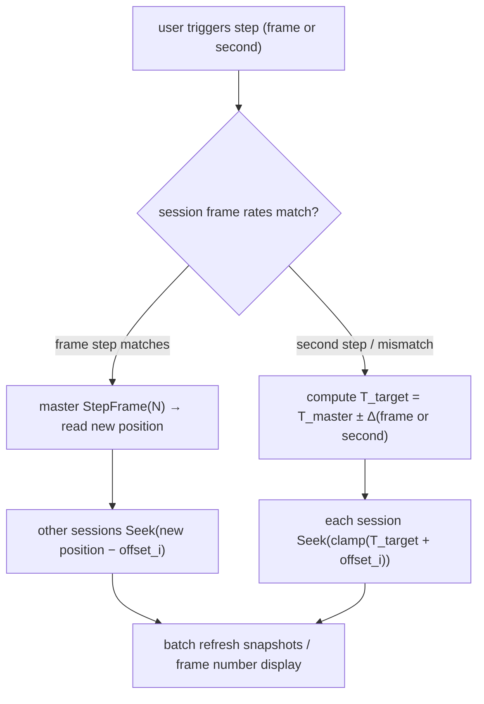

# 04 Sync Model Design

<div align="center">

**English** · [**简体中文**](04-同步模型设计.zh.md)

</div>

## 1. Goals & Constraints

- **Goal**: align multiple video streams on "the same picture", supporting sync stepping, sync Seek, sync playback, and offset calibration.
- **Constraints**:
  - Each 3FP session has an independent playback clock (PTS, 100ns);
  - The videos may have different starting PTS (e.g., trimmed from the middle) and different frame rates (24/23.976/25/30/60…);
  - 3FP supports `Seek(position100ns)` (arbitrary time), `SeekFrame(frameIndex)` (by each stream's own timeline), `StepFrame(±1)`;
  - 3FP snapshots provide `originalFramePTS`/`frameTimebase` which can be converted back to actual media time.

**Core principle**: the anchor for "same picture across sessions" is **media time (PTS-aligned canonical timeline)**, not frame index.
Frame index is only a fallback baseline (see 4.3).

## 2. Terms & Conversions

```
Media time (100ns integer) = PTS * timeBase * 10^7   (or obtained directly from media info position100ns)

Session clock:      position100ns   (3FP snapshot.position100ns)

Frame index:        frameIndex      (3FP snapshot.frameIndex, 0-based)

Canonical timeline T:  this project uses TimeSpan/100ns integers globally
Each session has:      base offset offset_i (default 0; manually adjustable ±time/±frames)
That is:  canonical time T  →  session i's expected media time = clamp(T + offset_i)
```

- `Seek(T)`: all sessions `Seek(expected media time)`;
- `Step(+1)`: take T' = current canonical time + **master frame duration** (master frame duration = 1/fps, e.g. 23.976fps → 41708µs),
  all sessions `Seek(T')`; this is **time-based stepping**, guaranteeing consistent frame-number offsets.
- `StepFrame(±1)` native capability: only when all sessions have identical frame duration and continuous PTS,
  we can first `StepFrame(1)` on master then read its new position, and other sessions `Seek(that new position)` — to maintain precise alignment.

## 3. Master Clock & Playback Modes

### 3.1 Sync Playback (F6)

- Based on the **master session's (first stream) playback clock**: master reports position per frame/tick, others follow.
- Implementation: SyncController maintains `target canonical time`;
  - when master plays: UI polls master snapshot at high frequency → T = master position − offset_master;
  - other sessions don't need continuous following (playback cadence is approximate); only send a single `Seek(T)` when significant drift detected (> threshold, e.g. 200ms);
  - drift detection uses each session's snapshot.position.
- When paused: each session `pause()` holds a static frame; stepping only occurs in paused state (consistent with ICAT frame-by-frame inspection habit).
- **VRR independence (F29)**: playback cadence follows the master media clock, decoupled from display refresh rate;
  VRR being active or not doesn't change the stepping/Seek/offset algorithms (all calculated by media time/frame number), it only affects the presentation side where 3FP decides Present timing.

### 3.2 Sync Stepping (F7/F8/F12)

- Stepping must **first resolve the target canonical time to that frame's media time**, then `Seek(expected media time)` on each session,
  to avoid frame-index drift caused by EOF/decode buffers per session.
- When all sessions have different frame rates (e.g., 24 vs 25): "one frame" is ambiguous:
  - Approach A (recommended): step by master frame granularity; other sessions land on "nearest frame" (`Seek` to nearest frame);
  - Approach B: jump by coarse granularity like 1s/0.5s, suitable for quick scrubbing.
- `StepFrame` is only for **single-frame precise preview** (all sessions have same frame duration or accept their respective nearest frames).

**Dual stepping (F12)**: the transport bar provides **two sets of forward/backward buttons**:

| Set | Step size | Implementation |
| --- | --- | --- |
| Frame step | adjustable in settings (default ±1 frame) | `master StepFrame(N)` (when frame rates match) or `Seek(T_master ± N×frameDuration)` (when frame rates differ) |
| Second step | adjustable in settings (default ±1 second) | all sessions `Seek(T_master ± N×1s + offset_i)`, clamped to duration |

- Both step sets share the same "target canonical time" pipeline: any step button → compute T_target → each session Seeks;
- **9-stream scaling note**: with many sessions, use `batch multi-session Seek` + one round of snapshot refresh to avoid per-session serial dispatch causing visible desync;
- Stepping operations happen in paused state (consistent with ICAT habit); clicking step while playing **auto-pauses first** then steps.



### 3.3 Offset Calibration (F9)

- UI provides per-stream `±frames` / `±milliseconds` fine-tuning; internally converted to `offset_i` (100ns integer).
- Suggested manual calibration flow: pick reference stream → pause at a frame → step reference frame by frame → click "align to this frame" →
  system sets offset_i from the difference between master's current media time and target stream's current media time.
- Offsets can also be implemented by **dragging a stream's track on the timeline** (each track shows its own scale and the offset-applied scale).

## 4. Building the Canonical Timeline

### 4.1 PTS Alignment (recommended path)

- After successful open: read each session's `media info` (including stream timebase) and snapshot, build `FrameTable` (optional, see 4.2).
- Use `position100ns` directly as the session's media time (3FP already normalizes PTS to 100ns); no time_base conversion needed.
- If a video internally has non-zero-start PTS (source trimmed/stitched), 3FP's `position` already contains the intra-media time;
  in that case **intra-media alignment** is needed: trim to the earliest start using each session's `media info.startTime` (if any) or recording start point.

### 4.2 FrameTable (optional enhancement)

- For scenarios requiring "exact same frame across videos" (e.g., frame-by-frame comparing before/after compression of the same scene),
  generate a...