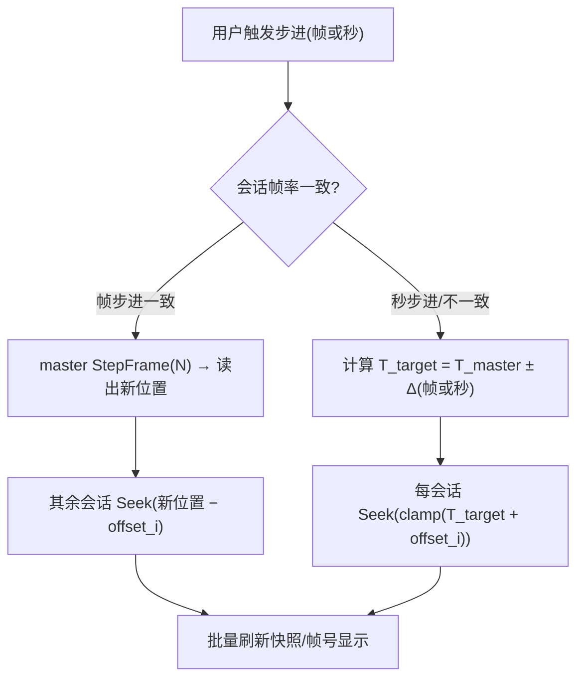

# 04 同步模型设计

<div align="center">

[**English**](04-同步模型设计.en.md) · **简体中文**

</div>

## 1. 目标与约束

- **目标**：多路视频在"同一画面"上对齐，支持同步步进、同步 Seek、同步播放、偏移校准。
- **约束**：
  - 3FP 每会话有独立播放时钟（PTS，100ns）；
  - 各视频起点 PTS 可能不同（如从中间裁剪过）、帧率可能不同（24/23.976/25/30/60…）；
  - 3FP 支持 `Seek(位置100ns)`（任意时间）、`SeekFrame(帧索引)`（按各自时间轴的帧）、`StepFrame(±1)`；
  - 3FP 的快照提供 `原始帧PTS`/`帧时间基`，可换算回实际媒体时间。

**核心原则**：跨会话"同一画面"的锚是 **媒体时间（PTS 对齐后的规范时间轴）**，而非帧索引。
帧索引只作为回退基准（见 4.3）。

## 2. 名词与换算

```
媒体时间(100ns 整数) = PTS * timeBase * 10^7   （或 Docker 从媒体信息 DIRECTLY 取得位置100纳秒）

会话时钟:       位置100ns   (3FP 快照.位置100纳秒)

帧索引:         帧序号     (3FP 快照.帧序号，0 基)

规范时间轴 T:   本项目全局使用 TimeSpan/100ns 整数
每个会话有:     基准偏移 offset_i (默认 0；可手动 ±时间/±帧)
即: 规范时间 T  →  会话 i 的期望媒体时间 = clamp(T + offset_i)
```

- `Seek(T)`：所有会话 `Seek(期望媒体时间)`；
- `步进(+1)`：取 T' = 当前规范时间 + **基准帧时长**（master 帧时长 = 1/帧率，如 23.976fps 为 41708µs），
  所有会话 `Seek(T')`；这是**按时间步进**，保证帧号一致偏移。
- `StepFrame(±1)` 原生能力：仅当所有会话帧时长一致且 PTS 连续时，可先对 master
  `StepFrame(1)` 再读取其新位置，其余会话 `Seek(该新位置)` —— 以此保持精确对齐。

## 3. 主时钟与播放模式

### 3.1 同步播放（F6）

- 以 **master 会话（第一路）** 的播放时钟为基准：master 每帧/每 tick 上报位置，其余会话跟随。
- 实现：SyncController 维护 `目标规范时间`；
  - master 播放时：UI 高频轮询 master 快照 → T = master 位置 − offset_master；
  - 其余会话无需持续跟随（播放节奏近似），仅在显著偏差（> 阈值，如 200ms）时发一次 `Seek(T)` 纠正；
  - 偏差检测用各会话快照.位置计算。
- 暂停时：各会话 `暂停()` 保持静态帧；步进仅在暂停态进行（与 ICAT 盯帧习惯一致）。
- **VRR 无关性（F29）**：播放节奏以 master 媒体时钟为准，与显示器刷新率解耦；
  VRR 生效与否不改变步进/Seek/偏移的算法（全部按媒体时间/帧号计算），只是在呈现侧由 3FP 决定 Present 时机。

### 3.2 同步步进（F7/F8/F12）

- 步进必须**先全局把目标规范时间解析为该帧的媒体时间**，再对每会话 `Seek(期望媒体时间)`，
  以避免各会话由于 EOF/编解码缓冲导致的帧序号漂移。
- 当全部会话帧率不同（如 24 vs 25）时："一帧"含义分歧：
  - 处理 A（推荐）：步进按 master 帧粒度，其余会话落点到"最近帧"（`Seek` 取最近帧）；
  - 处理 B：按 1 秒/0.5 秒粗粒度跳帧，适合快速粗看。
- `StepFrame` 仅用于**单帧精确预览**场景（所有会话帧时长一致或接受各自最近的帧）。

**双步进（F12）**：传输栏提供**两组前进/后退按钮**：

| 组 | 步长 | 实现 |
| --- | --- | --- |
| 按帧步进 | 设置中可调（默认 ±1 帧） | `master StepFrame(N)`（帧率一致时）或 `Seek(T_master ± N×帧时长)`（帧率不一致时） |
| 按秒步进 | 设置中可调（默认 ±1 秒） | 所有会话 `Seek(T_master ± N×1s + offset_i)`，clamp 到时长 |

- 两组步进共用同一条「目标规范时间」流水线：任何步进按钮 → 计算 T_target → 各会话 Seek；
- **9 路扩展注意**：会话较多时使用 `多路会同 Seek` 批量派发 + 一轮快照刷新，避免逐个串行造成显示不同步；
- 步进操作在暂停态进行（与 ICAT 习惯一致）；播放态点击步进先**自动暂停**再步进。



### 3.3 偏移校准（F9）

- UI 提供每路 `±帧` / `±毫秒` 微调；内部换算成 `offset_i`（100ns 整数）。
- 手动校准流程建议：选择参考路 → 在某帧暂停 → 逐帧步进参考路 → 点"对齐于此帧" →
  系统按 master 当前媒体时间与目标路当前媒体时间之差设置 offset_i。
- 偏移用**鼠标拖拽时间轴某路轨道**也可实现（时间轴每路显示自己的刻度与偏移后的刻度）。

## 4. 规范化时间轴的建立

### 4.1 PTS 对齐（推荐路径）

- 打开成功后：读取各会话 `媒体信息`（含流时间基）与快照，建立 `FrameTable`（可选，见 4.2）。
- 直接使用 `位置100纳秒` 作为会话媒体时间（3FP 已把 PTS 归一为 100ns），无需自己换算 time_base。
- 若个别视频内部 PTS 从非 0 开始（源文件裁剪/拼接），3FP 的 `位置` 已含片内时间；
  此时我们需要**片内对齐**：以各会话 `媒体信息.起始时间(若有)` 或录制起点为准削齐。

### 4.2 帧表（FrameTable，可选增强）

- 对需要"精确到帧的同一帧"的场景（如逐帧对比压缩前后同一画面），按视频帧率生成