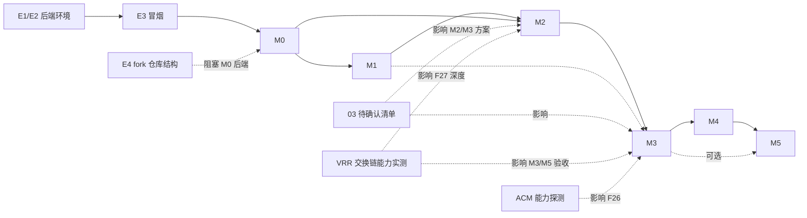

# 05 里程碑与任务分解

## ✅ 当前进度（0.1.2-BETA，2026-08-19）

- **E1–E4（前置）**：✅ 完成 — FFF.Native 源码 fork + submodule 固定 commit + 补丁层（patches/）；FFmpeg/libass 已就绪
- **M0 骨架**：✅ 完成 — 2 路同步步进、传输栏、SyncController v1
- **M1 9 路布局**：✅ 完成 — 1~9 路网格（新增网格布局预设菜单）、偏移校准、时间轴、全屏/窗口切换
- **M2 播放增强**：✅ 完成 — 同步播放/循环、自适应轮询（16/250ms）、步长可调、音量独立控制
- **M3 对比工具**：✅ 完成 — 探针 / 放大镜 / A-B 滑块 / 书签 / 差异叠加 / 同步缩放平移 / 时间轴缩略图预览；DisplayCapabilities（DXGI）已实现
- **M4 工程化**：✅ 完成 — 二级设置窗口（分页标签）、会话保存/加载、快捷键系统、设置 JSON
- **M5 打磨与发布**：🔄 进行中 — 0.1.2-BETA 双版本（精简 / 完整）已发布并运行时验证；性能基准、用户文档（使用说明.txt 已随包）、ACM/VRR 专项实测待做

---

## 0. 前置：环境与后端准备（单独列出）

| # | 任务 | 说明 |
| --- | --- | --- |
| E1 | 获取/构建 `FFF.Native` 源码与产物 | **MIT 许可已确认**，可以源码二次开发；按上游 `tools/构建3FP.ps1` 构建；记录 commit hash |
| E2 | 准备 Shared FFmpeg DLL 组 + libass | 固定 commit/版本；复制到运行目录或加入 PATH |
| E3 | 建立“后端可达性冒烟测试” | 无 UI 控制台工程：打开视频→暂停→StepFrame(1)→读快照→断言；用上游测试风格最小复刻 |
| E4 | 建立 **fork 仓库结构**（submodule + 补丁层） | `FFF.Native` 以 git submodule 引入；扩展 API 用独立 commit 维护（见 03 §6） |

> E1–E4 是所有里程碑交付的硬前置，M0 的完成定义依赖 E3 通过。

## M0：骨架 — 2 路同步步进（对标 ICAT 最小闭环）

**目标**：能够打开 2 个视频，同步暂停/单帧步进，显示帧号与时间；为之后的扩展打地基。

任务：

1. 创建解决方案骨架：
   - `src/3FCompare.App`（WinForms，.NET 11）
   - `src/3FCompare.Core/Backend`、`Core/Sync`、`Core/Compare`、`Core/Settings`、`Core/Models`
   - `tests/3FCompare.Core.Tests`
2. `Backend.3FP` 互操作层最小实现（P/Invoke，不复用托管 `FFF.Player`）：
   - `IPlayerEngine`：创建/打开/暂停/停止/Seek/Step/快照/媒体信息/探针
   - `EngineSession` 封装原生会话句柄 + 事件回调线程纪律（借鉴上游托管层语义）
3. `PlayerSurface` 控件：独立原生窗口(Handle)+设置输出窗口；resize 重设输出窗口
4. `CompareGridView`：2 路并排占满，点击选中
5. 传输栏：打开文件、暂停/播放、**双步进（±帧/±秒两组按钮）**、显示帧号/时间
6. SyncController v1：PTS 基准 + `Seek` 步进（第 0 个会话为 master）
7. E3 冒烟测试工程化进自动化测试

**DoD**：2 路 1080p 同时打开；方向键/按钮逐步进（帧/秒两组）同帧；帧号/时间实时一致；探针可读某一像素；拖拽打开文件。

## M1：9 路支持与布局

1. **1~9 路 PlayerSurface + 网格布局 1x1/2x1/2x2/3x2/3x3**（选中高亮）
2. 布局模型 `LayoutModel.Viewport`（各 Surface 位置尺寸统一由渲染循环更新）
3. 每路偏移校准 UI（±帧/±ms；“对齐于此帧”）
4. 媒体信息面板（分辨率/帧率/编码/色彩）
5. 时间轴 v1：多轨道刻度（每路独立时间轴 + 全局主刻度），支持点击 Seek
6. 失败会话的错误占位 UI
7. **全屏/窗口模式切换（FullscreenController 初版）**

**DoD**：9 路同时打开并同步步进；任意路可被选中、单屏查看；偏移校准后两路同帧对齐；时间轴拖动全路 Seek；窗口/全屏可互切。

## M2：播放增强与循环

1. 同步播放/暂停/停止（含偏差自动纠正，见 04 §3.1）
2. 播放速度：先做 0.5x/1x/2x 的“取帧播放”模式（对齐 A2 决策）；若 3FP 有速率 API 则直接使用
3. 区间循环（A/B 点）：时间轴打点、循环开关、边界自动 Seek
4. 快照高频轮询引擎（60Hz）+ 帧号/时间刷新统一
5. 多路音量独立控制（默认静音音频，评测只看画面）
6. **硬件编解码开关 + 多显卡 GPU 指定（A11 落地）**：全局/每路开关；枚举适配器选择某路 GPU
7. **按帧/按秒步长可在运行时调整（联动设置窗口）**

**DoD**：同步播放 2/4 路稳定不飘（偏差 < 200ms）；A/B 循环反复盯帧流畅；每路可静音。

###（M3 前置确认）A8/A9：VRR 交换链能力实测

- 用 E3 冒烟工程实测：3FP 交换链是否支持 `ALLOW_TEARING`/可变刷新率；Present 是否跟随媒体帧率；
- **因已 fork 源码**：实测后直接以补丁形式实现 `FFF3FP_SetPresentConfig`（见 03 §6），
  无需等待上游；产出结论写入 ReleaseNotes。

## M3：对比工具

1. 像素探针面板：鼠标取点 → RGBA/位深/色彩模式显示；文本复制
2. 放大镜覆盖层（Center/Loupe 两种样式）
3. A-B 滑块视图（同区域两路并行、滑块切换显示两侧）
4. 同步缩放/平移：
   - 优先向 3FP 要“视口矩形”能力（A3 确认）；
   - 否则 UI 回读+缩放兜底（限单屏模式）
5. 书签：帧号/时间/备注 → CSV/JSON 导出
6. 差异叠加（可选，A4 确认后实施）：同参数下逐像素 |ΔRGB| 热力图

**M3 附带（ACM/广色域，F24–F26）**：

7. `DisplayCapabilities` 探测（DXGI 枚举输出：Advanced Color/HDR/位深/色域）并联动 3FP 降级事件
8. 探针/差异/截屏统一「颜色管理前」码值路径；覆盖层在 ACM 显示器上的色彩验收

**DoD**：任意路可放大局部平移；探针读数准确（与参考像素比对测试）；A-B 滑块流畅；导出的书签可被表格软件打开；
SDR/HDR 会话在启用了 ACM 的显示器上呈现正确，探针码值与 3FP 色彩模式一致。

## M4：工程化

1. **二级设置窗口**（SettingsDialog）：硬件页/GPU 选择/步进页/窗口页/解码色彩页/布局页（详见 02 §4.5）
2. 设置存储（JSON）。NativeAOT 兼容（见 06 R15）：解码模式、色彩模式、**GPU 选择、步进步长**、快捷键、默认布局、探针面板偏好
3. 会话保存/恢复（文件列表+偏移+布局+当前帧+循环区间）
4. 快捷键系统（可自定义，默认对齐 ICAT 常见键位：Space 播放/暂停、←/→ 帧步进、Shift+←/→ 秒步进、1-9 切路等）
5. 错误汇报与崩溃日志（写本地日志文件）
6. 自动更新检查（可选；若用单文件发布考虑跳过）

**DoD**：设置窗口可改硬件/GPU/步长并即时或重启生效；重启后一键恢复上次会话；快捷键完整可自定义；日志能排查崩溃。

## M5：打磨与发布

1. 打包：NativeAOT 自包含单文件（.NET 11）+ 外置 FFmpeg DLL；发布目录说明
2. 性能回归基准（对照 3FP 上游测试精神）：4 路 1080p 步进延迟、内存、显存；**对比 AOT 与框架依赖启动耗时**
3. 用户文档（使用说明/快捷键表/FAQ）+ 发布说明
4. 图标/资源/本地化（可中文界面，跟随 3FP 项目风格）
5. ACM/广色域/VRR 专项验收（见 01 文档 §5.1）在真实 HDR/VRR 显示器上跑通并记录结果
6. 可选：接入 3FUI 剪贴板/参数面板互通（面向剪辑区间的深度用户）

**AOT 特别关注**：`Backend.3FP` 全部 P/Invoke 走 `[LibraryImport]`（静态链接 symbol 名）；若上游 `FFF3FP_` 导出均可用 `ExactSpelling` 静态解析则 AOT 顺利；运行前做一次 AOT 编译门禁测试。

**DoD**：发布包开箱即用；文档齐全；性能数据达标记录在案。

## 依赖关系图

## 工作量粗估（人·天，单人头）

| 里程碑 | 预估 | 主要不确定点 |
| --- | --- | --- |
| M0 | 4–6 | fork 仓库结构、互操作层、PlayerSurface/HWND 细节 |
| M1 | 5–8 | 布局重绘、时间轴多轨道 |
| M2 | 3–5 | 播放速度方案、VRR 补丁、偏差纠正调优 |
| M3 | 5–8 | 视口补丁、全帧回读补丁选型 |
| M4 | 3–5 | 设置/快捷键 UX 打磨 |
| M5 | 2–4 | 打包、性能优化 |
| 合计 | 22–36 | |

> 均为粗估；A2/A3/A4 决策落地后可进一步收敛。增量优先，每个里程碑独立可演示。